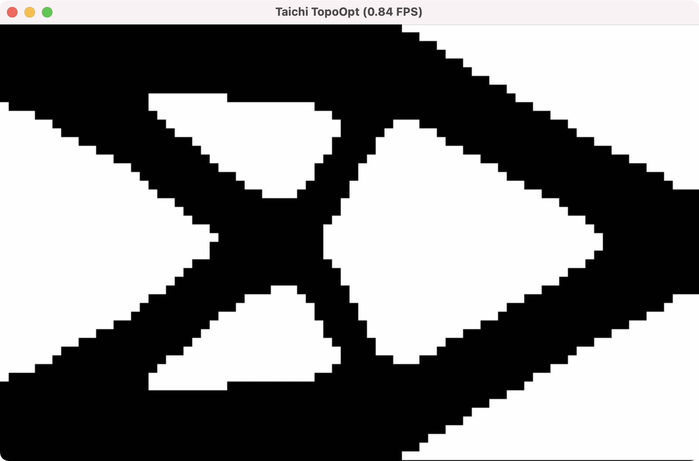

# Taichi TopOpt 

### (Under Active Development)

## Intro
A topology optimization framework written in Taichi programming language, which is embedded in Python.
## Requirement 
+ taichi 0.7.31
+ numpy
+ scipy
## How to use
run [main.py](simp.py)

## Feature
1. SIMP
2. BESO
3. Basic sensitivity filtering 
4. MGPCG solver (TODO)
5. More...

## Reference
1. [A 99 line topology optimization code written in MATLAB](https://www.topopt.mek.dtu.dk/apps-and-software/a-99-line-topology-optimization-code-written-in-matlab)
2. [cg_possion.py](https://github.com/houkensjtu/taichi-experiment/blob/master/homework-1/cg_possion.py)
3. [BESO2D.py](https://github.com/ToddyXuTao/BESO-for-2D)
4. Zuo, Z.H. and Xie, Y.M., 2015. A simple and compact Python code for complex 3D topology optimization. Advances in Engineering Software, 85, pp.1-11.
5. Huang, X. and Xie, M., 2010. Evolutionary topology optimization of continuum structures: methods and applications. John Wiley & Sons.
