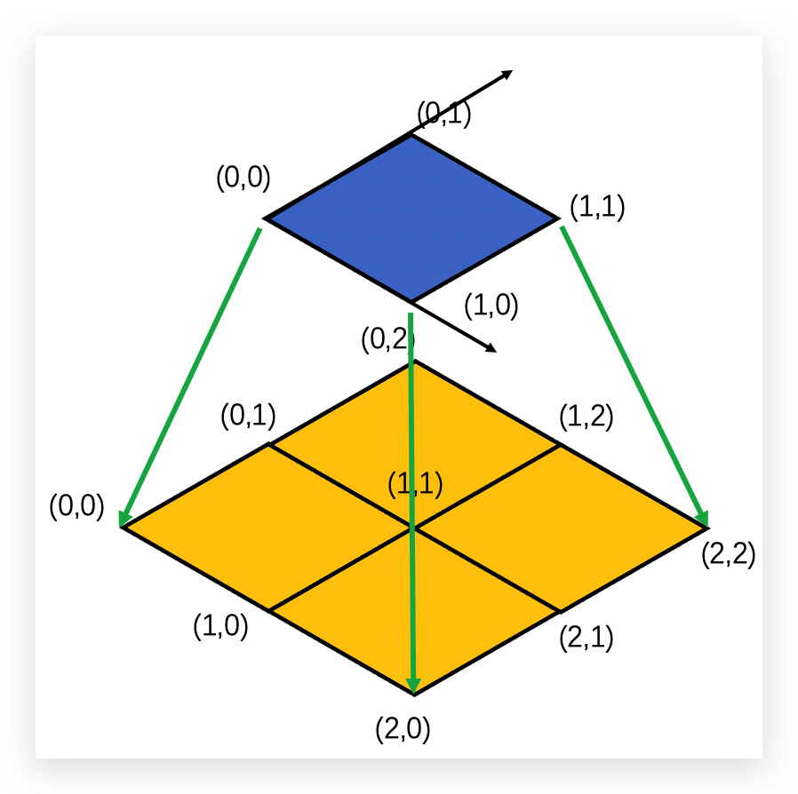

# MGPCG 

一些关键问题
1. (Todo) Galerkin coarsening的插值矩阵不能显式存储（内存bottleneck）需要在restrict和prolongate中on-the-fly计算

2. 自由度在多重网格下的对应

    解决方案：需要通过节点2维坐标得到自由度，节点2维坐标在多重网格下具有倍数关系
    
    
3. 边界条件(fixed nodes)如何在多重网格下满足

    解决方案：在smooth和cg过程中保证边界条件
